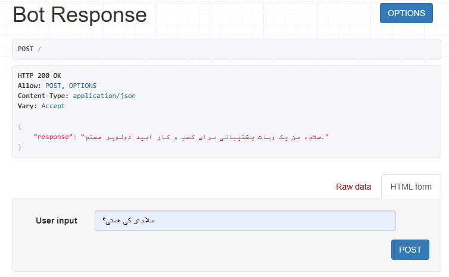
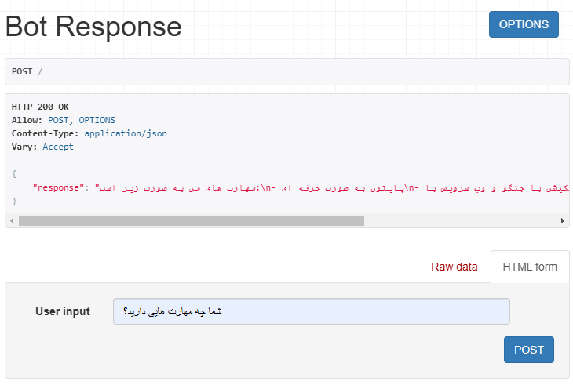
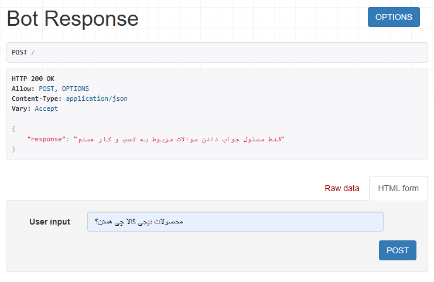
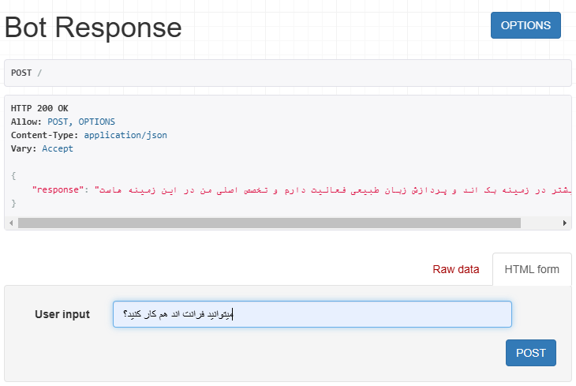
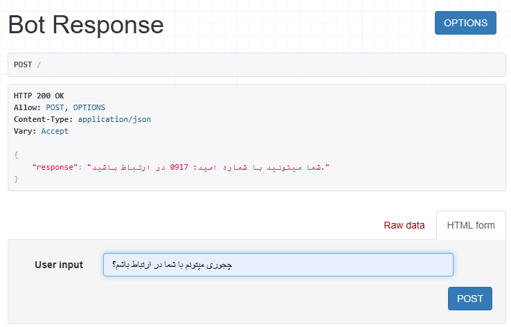

<head>
  <link href="https://fonts.googleapis.com/css2?family=Vazirmatn:wght@300;400;500;700&display=swap" rel="stylesheet">
</head>

<body dir="rtl" style="font-family: 'Vazirmatn', sans-serif;">

# support chatbot چت بات پشتیبانی

# مقدمه
این پروژه یک چت بات پشتیبانی است که به کسب و کارها این امکان را می‌دهد تا اطلاعات خود، محصولات، توضیحات ضروری و سوالات پر تکرار را در سامانه ذخیره کنند. پس از آن، کسب و کارها می‌توانند سوالات مشتریان خود را به وب سرویس ارسال کرده و پاسخ‌های مناسب را دریافت کنند. در این پروژه از فناوری‌های لنگچین برای پردازش داده‌ها، جنگو به عنوان فریمورک اصلی برای توسعه وب، و جنگو رست فریمورک برای ساخت API استفاده شده است. هدف این پروژه بهبود تجربه مشتری و کاهش زمان پاسخ‌دهی به سوالات متداول است. برای مثال من اطلاعاتی از خودم به عنوان کسب و کار در سامانه ذخیره کردم که بعد از درخواست های زیر پاسخ هایی دریافت کردم.

# عکس هایی از درخواست ها
<br/>
<br/>
<br/>
<br/>
<br/>
<br/>

# روش راه اندازی

1. **کلون کردن مخزن پروژه**
   ```bash
   git clone https://github.com/hopedeveloper08/support_chatbot
   cd support_chatbot
   ```

2. **ایجاد محیط مجازی**
   ```bash
   python -m venv venv
   ```

3. **فعال کردن محیط مجازی**
   - در ویندوز:

     ```bash
     venv\Scripts\activate
     ```

   - در macOS/Linux:

     ```bash
     source venv/bin/activate
     ```

4. **نصب وابستگی‌ها**
   ```bash
   pip install -r requirements.txt
   ```

5. **پیکربندی پایگاه داده**
   ```bash
   python manage.py migrate
   ```

6. **اجرای سرور توسعه**
   ```bash
   python manage.py runserver
   ```

7. **دسترسی به برنامه**
   ```
   http://127.0.0.1:8000/
   ```


</body>